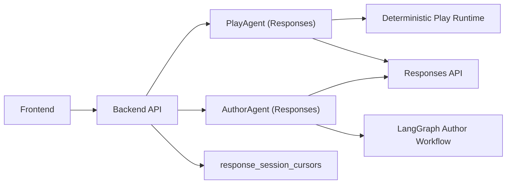
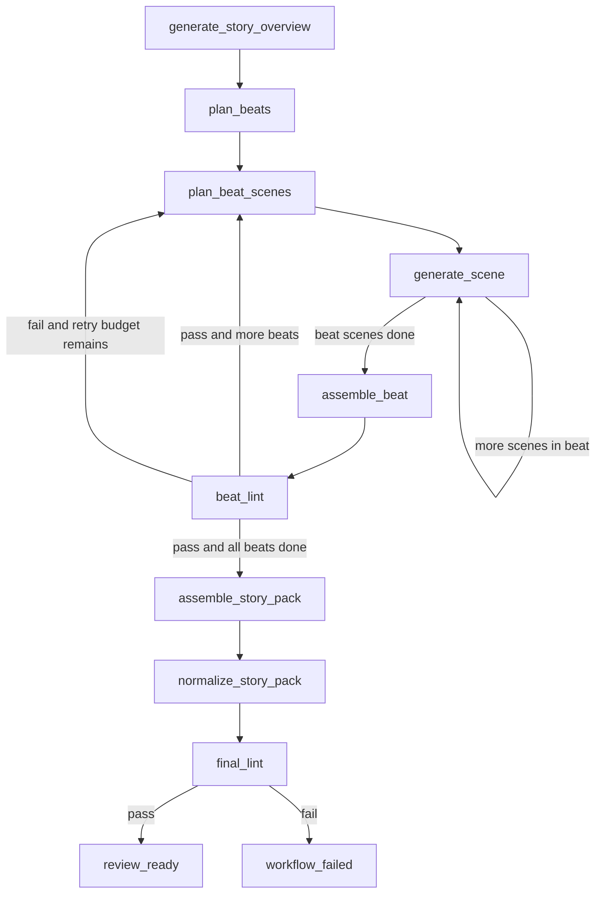

# RPG Demo

Single-backend architecture powered by a direct Responses API integration.

## Current Architecture



- No internal worker service in the active runtime path.
- Play Mode keeps deterministic resolution logic in backend code.
- Author Mode keeps LangGraph orchestration with deterministic non-LLM nodes.
- Responses cursor reuse is done via `previous_response_id`, persisted per scope/channel in `response_session_cursors`.
- Cursor reuse invariant: if stored cursor model differs from current model, backend clears the cursor before any Responses call.

## Core Runtime Paths

### Play Mode

Play Mode is single-agent at the LLM boundary and deterministic for state changes:

1. free-text player input goes to `PlayAgent.interpret_turn`
2. backend runtime resolves the chosen move, effects, and next scene deterministically
3. `PlayAgent.render_resolved_turn` turns the resolved state into player-facing narration

Button input skips interpretation and reuses the same deterministic resolution + render path.

Current backend module shape:

- `rpg_backend/runtime/service.py` is the thin runtime facade
- `rpg_backend/runtime/compiled_pack.py` builds read-only scene/move/beat/NPC indexes per runtime call
- `rpg_backend/runtime/step_engine.py` drives route -> resolve -> effects -> next scene -> narration using compiled pack data
- `rpg_backend/runtime/router.py` owns free-text move routing and delegates context assembly to `runtime/route_context.py`
- `rpg_backend/runtime/narration.py` owns player-facing render transport and delegates deterministic scaffold/context assembly to `runtime/narration_context.py`
- `rpg_backend/application/session_step/*` owns validation, idempotency, CAS commit, and event emission around the runtime call

### Author Mode

Author Mode keeps a LangGraph workflow with scene-by-scene beat generation:

1. `generate_story_overview`
2. `plan_beats`
3. `plan_beat_scenes`
4. `generate_scene` (repeat until current beat scene plan is complete)
5. `assemble_beat`
6. `beat_lint`
7. `assemble_story_pack`
8. `normalize_story_pack`
9. `final_lint`

Important current behavior:

- Author LLM nodes are `generate_story_overview`, `plan_beat_scenes`, and `generate_scene`
- each beat is generated scene-by-scene and then assembled deterministically into a `BeatDraft`
- `generate_scene` now focuses on scene semantics (seed, present NPCs, local move intent + consequence flavor), while backend assembly owns ids, `enabled_moves`, `always_available_moves`, outcome ids, and standard scene progression wiring
- generation is one beat at a time; if beat lint fails, only the current beat is retried
- accepted prior beats stay fixed and feed continuity through `last_accepted_beat`, `prefix_summary`, and `author_memory`

### Author Flow (Current)



### Assembly And Normalization

The final pack steps are intentionally separate:

- `assemble_story_pack` stitches accepted beat drafts into one `StoryPack`, injects cross-beat exits, adds global moves, and builds opening guidance inputs
- `normalize_story_pack` validates the pack shape and fills any missing standard fields such as `opening_guidance`
- `final_lint` is the playable-first gate before `review_ready`

### Cursor / KV Reuse

Responses cursor reuse is scoped by channel:

- Play: `play_agent`
- Author overview: `author_overview`
- Author beat scene planning: `author_beat_plan`
- Author scene generation: `author_scene:<beat_id>`

On invalid or expired cursor errors, the backend clears the stored cursor and retries once without `previous_response_id`.
If cursor model mismatches current model, backend clears the cursor first and skips stale `previous_response_id` reuse.

## Responses Config

Use only these active env vars:

- `APP_RESPONSES_BASE_URL`
- `APP_RESPONSES_API_KEY`
- `APP_RESPONSES_MODEL`
- `APP_RESPONSES_TIMEOUT_SECONDS` (default `20.0`)
- `APP_RESPONSES_ENABLE_THINKING_PLAY` (default `false`)
- `APP_RESPONSES_ENABLE_THINKING_AUTHOR_OVERVIEW` (default `false`)
- `APP_RESPONSES_ENABLE_THINKING_AUTHOR_BEAT_PLAN` (default `true`)
- `APP_RESPONSES_ENABLE_THINKING_AUTHOR_SCENE` (default `true`)
- `APP_RESPONSES_ENABLE_THINKING_STORY_QUALITY_JUDGE` (default `false`)

Recommended current defaults:

- Play keeps thinking off for latency
- Author overview usually keeps thinking off
- Author beat scene planning usually keeps thinking on
- Author scene generation usually keeps thinking on
- Story quality judge can be toggled independently from runtime traffic

Reference template: [`/Users/lishehao/Desktop/Project/RPG_Demo/.env.llm.example`](/Users/lishehao/Desktop/Project/RPG_Demo/.env.llm.example)

## Local Development

```bash
./scripts/dev_stack.sh up
./scripts/dev_stack.sh ready
./scripts/dev_stack.sh logs backend
./scripts/dev_stack.sh logs frontend
```

Stop services:

```bash
./scripts/dev_stack.sh down
```

## Key API Contracts (unchanged)

- `POST /sessions`
- `POST /sessions/{session_id}/step`
- `POST /author/runs`

Public response shape for play/author remains stable; admin/dev telemetry fields now use single-agent semantics (`agent_model`, `agent_mode`, `response_id`, `reasoning_summary`).
