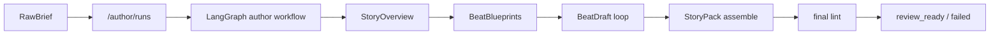
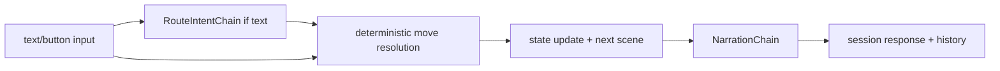

# RPG Demo Engineering Overview

This repository is a backend-first interactive narrative RPG system with two product rails:

- **Author Mode**: generate, review, and publish story packs
- **Play Mode**: run published stories through a strict runtime loop

The current implementation is optimized for engineering clarity over framework novelty:

- Author generation uses **LangGraph** for long-running workflow orchestration
- Play runtime uses **thin LangChain chains** only where LLMs add value
- State transitions, outcomes, and persistence stay deterministic in backend code
- All upstream model access is isolated behind an internal **LLM worker**

---

## Product Rails

### Author Mode

Author Mode starts from a raw natural-language brief and materializes a DB-backed draft.



Key points:

- Entry point: `POST /author/runs`
- Workflow state is persisted through explicit run/event/artifact tables
- Beat generation uses `BeatDraftLLM -> normalize -> BeatDraft`
- A story is publishable only when the latest run reaches `review_ready`
- Draft editing remains on `/stories/{story_id}/draft`

### Play Mode

Play Mode consumes only **published** story versions.



Key points:

- Text input uses a short-key route selection step (`m0`, `m1`, ...)
- Button input bypasses LLM routing entirely
- Outcome choice, effect application, and scene transition are deterministic
- Narration is generated only **after** the outcome is fixed
- Runtime remains fail-fast on routing/narration failures

---

## Core Engineering Decisions

### 1. LLMs do not own the state machine

This system does **not** use agent-style free-form orchestration.

Instead:

- **LangGraph** is used only for Author Mode workflow control
- **LangChain** is used only for:
  - route selection in Play Mode
  - narration rendering in Play Mode
  - structured generation nodes in Author Mode
- the backend owns:
  - game state
  - outcome selection
  - validation
  - persistence
  - publish gating

### 2. Worker transport is unified on `json_object`

The backend does not call upstream models directly.

All model traffic goes through the internal worker:

- backend -> worker
- worker -> upstream OpenAI-compatible endpoint

Current worker task surface is intentionally minimal:

- `POST /internal/llm/tasks/json-object`
- `GET /health`
- `GET /ready`

There are no longer separate worker tasks for route-intent or narration.

### 3. StoryPack is the runtime truth

The runtime reads `StoryPack`, not intermediate author schemas.

Important implications:

- `StoryPack` lint is the final structural gate
- scene strategy triangle is a hard requirement
- `fail_forward` is mandatory
- NPC red lines and conflict tags are explicit runtime data

### 4. Publish is a guarded operation

Publishing is intentionally conservative.

A story can be published only if:

- the latest Author run is `review_ready`
- the current saved draft passes the final linter

This prevents stale or partially failed author runs from leaking into Play Mode.

---

## Repository Map

Primary backend packages:

- `rpg_backend/api`: FastAPI routes and contracts
- `rpg_backend/application`: orchestration and transaction boundaries
- `rpg_backend/domain`: StoryPack DSL, linter, move library, runtime invariants
- `rpg_backend/generator`: author workflow nodes and deterministic generation helpers
- `rpg_backend/runtime`: session runtime, routing, resolution, UI shaping
- `rpg_backend/runtime_chains`: thin LangChain wrappers for Play Mode
- `rpg_backend/llm`: worker-backed LLM abstraction
- `rpg_backend/llm_worker`: internal worker service
- `rpg_backend/storage`: SQLModel entities and migrations
- `frontend`: React + Vite author/play UI

Important supporting artifacts:

- `contracts/openapi/backend.openapi.json`: backend contract artifact
- `frontend/src/shared/api/generated/backend-sdk.ts`: generated frontend SDK metadata
- `docs/architecture.md`: deeper architecture narrative
- `docs/runtime_status.md`: implementation status matrix

---

## Runtime and Data Boundaries

### Auth

- Admin login endpoint: `POST /admin/auth/login`
- Business routes require Bearer auth
- Only `/health`, `/ready`, and `/admin/auth/login` are anonymous

### Author APIs

Current primary author endpoints:

- `POST /author/runs`
- `GET /author/runs/{run_id}`
- `GET /author/runs/{run_id}/events`
- `GET /author/stories`
- `GET /author/stories/{story_id}`
- `POST /author/stories/{story_id}/runs`
- `GET /stories/{story_id}/draft`
- `PATCH /stories/{story_id}/draft`
- `POST /stories/{story_id}/publish`

### Play APIs

Current play/session endpoints:

- `POST /sessions`
- `GET /sessions/{session_id}`
- `GET /sessions/{session_id}/history`
- `POST /sessions/{session_id}/step`

---

## Local Development

### Quick start

```bash
python -m venv .venv
source .venv/bin/activate
pip install -e '.[dev]'
cd frontend && npm install && cd ..
./scripts/dev_stack.sh up
./scripts/dev_stack.sh ready
```

Useful commands:

```bash
./scripts/dev_stack.sh status
./scripts/dev_stack.sh logs backend
./scripts/dev_stack.sh logs worker
./scripts/dev_stack.sh resetdb
./scripts/dev_stack.sh down
```

Notes:

- `./scripts/dev_stack.sh up` starts local PostgreSQL via Docker Compose, runs DB migrations, then starts services
- local development now defaults to PostgreSQL on `127.0.0.1:8132`
- `./scripts/dev_stack.sh resetdb` recreates local `rpg_dev` safely; no manual `app.db` workflow remains

---

## Configuration

Environment variables use the `APP_` prefix.

Most important ones:

- `APP_DATABASE_URL`
- `APP_AUTH_JWT_SECRET`
- `APP_INTERNAL_WORKER_TOKEN`
- `APP_LLM_WORKER_BASE_URL`
- `APP_LLM_OPENAI_BASE_URL`
- `APP_LLM_OPENAI_API_KEY`
- `APP_LLM_OPENAI_MODEL`
- `APP_LLM_OPENAI_ROUTE_MODEL`
- `APP_LLM_OPENAI_NARRATION_MODEL`
- `APP_LLM_OPENAI_GENERATOR_MODEL`

Security-critical expectations:

- `APP_AUTH_JWT_SECRET` must be set securely outside local dev
- `APP_INTERNAL_WORKER_TOKEN` must match between backend and worker
- worker task calls require `X-Internal-Worker-Token: ${APP_INTERNAL_WORKER_TOKEN}`

---

## Engineering Guardrails

### Route constants

Do not hardcode business route strings in production code.

Use:

- `rpg_backend/api/route_paths.py`
- `rpg_backend/llm_worker/route_paths.py`

### Contract sync

If backend route contracts change:

```bash
source .venv/bin/activate
python -m scripts.export_openapi
python -m scripts.generate_frontend_sdk
```

### Migration safety

Backend and worker startup fail if the DB revision is not at Alembic head.

Migration references:

- `docs/db_migration_runbook.md`
- `deploy/k8s/*`
- `deploy/systemd/*`

---

## Verification

### Fast local regression

```bash
source .venv/bin/activate
python -m pytest -q
```

### System/browser gate

```bash
python scripts/release/run_author_play_release_gate.py
```

### System-only stability run

```bash
python scripts/release/run_author_play_stability.py
```

### Manual health checks

```bash
docker compose -f compose.yaml ps
curl http://127.0.0.1:8000/ready
curl http://127.0.0.1:8100/ready
```

---

## What to Read Next

- `/Users/lishehao/Desktop/Project/RPG_Demo/docs/architecture.md`
- `/Users/lishehao/Desktop/Project/RPG_Demo/docs/runtime_status.md`
- `/Users/lishehao/Desktop/Project/RPG_Demo/docs/deployment_probes.md`
- `/Users/lishehao/Desktop/Project/RPG_Demo/docs/db_migration_runbook.md`
- `/Users/lishehao/Desktop/Project/RPG_Demo/docs/oncall_sop.md`
