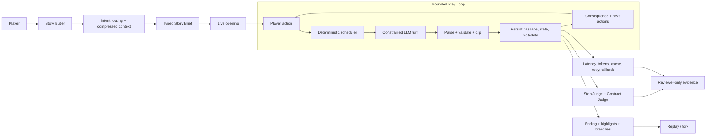

<h1 align="center">Tiny Stories</h1>

<p align="center">
  <strong>An inspectable LLM narrative runtime for bounded, stateful play.</strong>
</p>

<p align="center">
  One premise becomes a guided Story Brief, a live opening, 12 consequential
  turns, and a replayable ending.
</p>

<p align="center">
  <a href="https://github.com/lishehao/RPG_Demo/actions/workflows/ci.yml">
    
  </a>
  
  
  
  
  
</p>

<p align="center">
  <a href="https://youtu.be/RRJ7uyjW_nA"><strong>Watch the 75s demo</strong></a>
  &nbsp;|&nbsp;
  <a href="https://lishehao.github.io/RPG_Demo/app/#/demo/reviewer"><strong>Open the reviewer demo</strong></a>
  &nbsp;|&nbsp;
  <a href="./docs/tiny-stories-engineering-evidence-packet.md">Engineering evidence</a>
  &nbsp;|&nbsp;
  <a href="./docs/CURRENT_SYSTEM_MAP.md">System map</a>
  &nbsp;|&nbsp;
  <a href="./README.zh.md">中文</a>
</p>

<p align="center">
  <a href="https://youtu.be/RRJ7uyjW_nA">
    
  </a>
</p>

<table>
  <tr>
    <td width="33%"><strong>Product loop</strong><br/>Guided creation -> typed Story Brief -> live play -> ending and replay.</td>
    <td width="33%"><strong>Systems work</strong><br/>Structured contracts, persistent state, bounded metadata, evaluation, and telemetry.</td>
    <td width="33%"><strong>Evidence boundary</strong><br/>Validated as an AI product system, not claimed as a proven consumer game.</td>
  </tr>
</table>

> The public reviewer demo is deterministic and backend-free. It is safe to
> inspect without an API key, but it is not presented as a live-generation
> result. Live-system evidence is documented separately and reproducibly.

## The Product Question

Most LLM story demos stop at generated prose. Tiny Stories asks a narrower,
more demanding engineering question:

> Can an LLM story generator behave like a designed game loop rather than a
> prose-only chatbot?

The system treats generation as one component inside a stateful product. A
Story Butler interprets arbitrary input, maintains compressed context, and
hands off automatically when a playable Story Brief is ready. The runtime then
combines deterministic state transitions with constrained live generation,
persists the resulting trajectory, and compiles an ending from the path the
player actually took.

The target experience is a compact episode for story-first players: read the
current scene, compare a few meaningful moves, commit once, see what changed,
then act on that consequence. Narrative context stays close to decision
context; inner motive remains attached to the selected move; advisor support
lives with the scene cast; technical evidence stays outside normal Play.

```text
premise
  -> guided Story Butler conversation
  -> typed Story Brief
  -> live opening + player role + cast pressure
  -> 12-turn choose / act / react loop
  -> persisted ending + highlights + alternate branches
```

This is an AI product engineering case study: the model writes prose, while
the surrounding system owns state, authority, validation, persistence,
observability, and failure handling.

## Engineering Contribution

| System layer | Implementation | Why it matters |
| --- | --- | --- |
| **Guided creation agent** | Intent routing, rolling transcript, compressed story context, correction handling, skill-based next-question policy, and automatic readiness. | Arbitrary chat does not silently become story facts, and context does not grow without bound. |
| **Typed story compiler** | Story Brief contracts capture cast, player role, pressure, constraints, tone, and opening promise before play begins. | The runtime receives a playable contract instead of an unconstrained prompt. |
| **Hybrid turn runtime** | Deterministic schedulers prepare stage, NPC focus, inventory, and pressure before each constrained LLM turn. | Creative prose remains flexible while pacing and state stay inspectable. |
| **Gameplay envelope** | Validated live metadata enriches people, pressure, clue, and opportunity changes; backend and UI derivation remain tolerant fallbacks. | Choices produce visible game-state feedback without making optional model metadata a hard dependency. |
| **Reliability controls** | Typed parsing, clipping, duplicate-submit guards, retry-safe UI, persisted turn metadata, quota boundaries, and player-safe recovery. | Provider or schema problems do not become raw JSON, double turns, or hidden state corruption. |
| **Evaluation and observability** | Gold scenarios, Step Judge, Contract Judge, trajectory packaging, LLM call telemetry, and reviewer-only evidence surfaces. | Reliability claims can be inspected without exposing technical internals to normal players. |

## Live Evaluation Snapshot

The current evidence anchor is a fresh isolated run completed on 2026-07-16
through the configured live gateway.

| Check | Observed result |
| --- | --- |
| End-to-end path | Create -> Story Brief -> Opening -> 12 Play turns -> Ending |
| Required live calls | `live/success`; no required fallback |
| Turn completion | 12/12 |
| Step Judge | 12/12 pass |
| Contract Judge | 12/12 pass |
| Quality gate v2 | Pass across consequence clarity, choice diversity, escalation, character response, payoff, and playable options |
| Retry / fallback | 0 persisted retries; 0 required-operation fallbacks |
| Player surface | Generated ending rendered with no horizontal overflow and zero browser console warnings/errors |

The evidence is intentionally bounded. It demonstrates one reproducible system
trajectory, not population-level story quality, retention, or market demand.
The measured median live Play-turn latency was 14.0 seconds and remains a real,
provider-bound product risk.

For token counts, cache usage, per-operation latency, failure taxonomy, and the
claim boundary, read the
[Engineering Evidence Packet](./docs/tiny-stories-engineering-evidence-packet.md).

## Architecture


```mermaid
flowchart LR
    Player["Player"] --> Create["Story Butler"]
    Create --> Context["Intent routing + compressed context"]
    Context --> Brief["Typed Story Brief"]
    Brief --> Opening["Live opening"]

    subgraph Loop["Bounded Play Loop"]
        Action["Player action"] --> Scheduler["Deterministic scheduler"]
        Scheduler --> LLM["Constrained LLM turn"]
        LLM --> Validate["Parse + validate + clip"]
        Validate --> Persist["Persist passage, state, metadata"]
        Persist --> Feedback["Consequence + next actions"]
        Feedback --> Action
    end

    Opening --> Action
    Persist --> Judges["Step Judge + Contract Judge"]
    Persist --> Telemetry["Latency, tokens, cache, retry, fallback"]
    Persist --> Ending["Ending + highlights + branches"]
    Judges --> Reviewer["Reviewer-only evidence"]
    Telemetry --> Reviewer
    Ending --> Replay["Replay / fork"]
```

Three rules keep the architecture honest:

1. **Deterministic before generative.** The runtime decides what state and
   pressure the model must address before asking it to write.
2. **Optional metadata cannot fail the turn.** Valid live metadata produces a
   `live_enriched` envelope; missing or invalid metadata degrades to backend,
   then UI-derived evidence.
3. **Inspection is separated from play.** Normal players see story, choices,
   consequences, and people. Reviewer mode owns judge rows and sanitized
   telemetry; raw prompts, provider payloads, and private reasoning stay out.

## Reviewer Path

An admissions or recruiting reviewer can evaluate the project in this order:

1. [Watch the 75-second product demo](https://youtu.be/RRJ7uyjW_nA).
2. [Open the deterministic reviewer demo](https://lishehao.github.io/RPG_Demo/app/#/demo/reviewer)
   to inspect the interface without credentials or provider spend.
3. Read the [case study](./docs/CASE_STUDY.md) and
   [current system map](./docs/CURRENT_SYSTEM_MAP.md).
4. Inspect the [engineering evidence packet](./docs/tiny-stories-engineering-evidence-packet.md)
   for the live gate, telemetry, evaluation design, and overclaim guardrails.
5. Run locally and open `#/portfolio` or a Play route with `?reviewer=1` to
   inspect the live backend path.

Before citing a deployed route as application evidence, run:

```bash
python3 tools/portfolio_public_evidence_preflight.py
```

This checks whether the public branch and GitHub Pages deployment actually
contain the evidence being referenced.

## Evaluation Design

Tiny Stories does not use a single model-generated score as proof. Its release
evidence is layered:

- **Gold scenarios** cover arbitrary input, help/meta input, unsafe and not-fit
  prompts, high-drama creation, corrections, and Play consequences.
- **Step Judge** checks agency, consequence alignment, scene coherence, and
  whether the next state remains playable.
- **Contract Judge** checks response shape, option count, known entities,
  hidden-information leakage, leverage ownership, and inventory sanity.
- **Quality gate v2** packages deterministic trajectory evidence without
  claiming to be a calibrated fun metric.
- **Telemetry** records operation, live source/status, latency, input/cache/
  output tokens, retries, and fallback reason.
- **Mock-user tooling** supports repeatable episode traces and separate LLM
  quality review without replacing the deterministic release gates.

Start with:

- [Eval v3 redesign](./docs/eval/EVAL_V3_REDESIGN.md)
- [Mock-user agent chain](./docs/eval/MOCK_USER_AGENT_CHAIN.md)
- `tools/rpg_eval/tiny_stories_golden_path_harness.py`
- `tools/rpg_eval/gold_sets/tiny_stories_reliability.json`

## Source Map

| Concern | Primary source |
| --- | --- |
| Story Butler policy and memory | `rpg_backend/narrative/story_guide.py`, `rpg_backend/narrative/service.py` |
| Typed backend contracts | `rpg_backend/narrative/contracts.py` |
| LLM boundary and turn generation | `rpg_backend/narrative/engine.py`, `rpg_backend/narrative/gateway.py` |
| Session and metadata persistence | `rpg_backend/narrative/repository.py` |
| Frontend API contracts | `frontend2/src/api/contracts.ts` |
| Gameplay envelope | `frontend2/src/pages/play/play-gameplay-envelope.ts` |
| Play and reviewer UI | `frontend2/src/pages/play/` |
| Live/evaluation harnesses | `tools/rpg_eval/` |
| Product and claim boundary | `docs/CASE_STUDY.md`, `docs/PROJECT_PAUSE_2026-05-09.md` |

For the active product path versus retained experiments, use the
[Current System Map](./docs/CURRENT_SYSTEM_MAP.md).

## Run Locally

### Requirements

- Python 3.11
- Node.js 24 (the CI baseline)
- A DeepSeek V4 Flash compatible chat/completions endpoint

### Backend

```bash
python3 -m pip install -e ".[dev]"
cp .env.example .env
# Add APP_RESPONSES_PLAY_BASE_URL, APP_RESPONSES_PLAY_API_KEY,
# and APP_RESPONSES_PLAY_MODEL without committing secrets.

uvicorn rpg_backend.main:app --host 127.0.0.1 --port 8000 --reload
```

### Frontend

```bash
cd frontend2
npm ci
npm run dev
```

Open `http://127.0.0.1:8001`. Useful routes:

- `#/portfolio` - guided live reviewer path
- `#/demo/reviewer` - deterministic reviewer fixture
- `#/qa/play-action` - action-state rehearsal
- `#/qa/play-gameplay-loop` - typed gameplay loop fixture

### Verification

```bash
python3 tools/narrative_release_gate.py --mode fake
python3 -m pytest -q

cd frontend2
npm run check
npm run build
```

For a configured live backend:

```bash
python3 tools/http_product_smoke.py --base-url http://127.0.0.1:8000
```

## Status And Limits

Tiny Stories is complete as a portfolio-grade AI product systems case study.
It demonstrates a playable full-stack loop, typed LLM boundaries, persistent
state, evaluation harnesses, reviewer observability, a public deterministic
demo, and a reproducible video artifact.

It is **not** presented as a validated consumer product or research
contribution. Human completion, replay intent, retention, and organic sharing
remain unproven. The next product-validity step is a small observed playtest,
not another broad feature pass. The decision criteria are documented in the
[Project Pause Memo](./docs/PROJECT_PAUSE_2026-05-09.md).

MIT licensed. See [LICENSE](./LICENSE).
