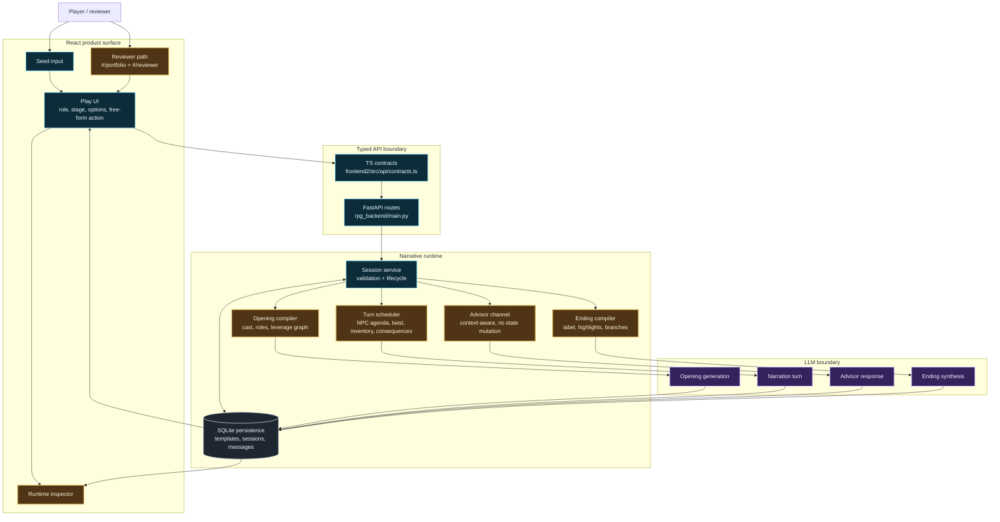

# Tiny Stories

<p align="center">
  <a href="https://lishehao.github.io/RPG_Demo/">
    
  </a>
</p>

<p align="center">
  <strong>An inspectable AI narrative runtime, not another story chatbot.</strong>
</p>

<p align="center">
  Type one premise. Tiny Stories compiles a short, story-first mobile episode:
  read a scene, compare a few meaningful moves, act once, then follow visible
  consequences through a playable 12-turn ending path.
</p>

<p align="center">
  <a href="#innovation">Innovation</a>
  · <a href="#architecture">Architecture</a>
  · <a href="#evaluation-v3">Evaluation</a>
  · <a href="./docs/CURRENT_SYSTEM_MAP.md">System map</a>
  · <a href="./docs/CASE_STUDY.md">Case study</a>
  · <a href="#run-locally">Run locally</a>
  · <a href="./README.zh.md">中文</a>
</p>

<p align="center">
  
  
  
  
  
  
</p>

<table>
  <tr>
    <td><strong>Player-facing</strong><br/>A seed becomes a short interactive drama with role cards, choices, free-form action, advisor help, and a compiled ending.</td>
    <td><strong>Runtime-driven</strong><br/>Deterministic schedulers shape pressure, state, inventory, and consequences before each LLM call.</td>
    <td><strong>Reviewable</strong><br/>Portfolio and reviewer routes expose the contracts, state, and boundaries behind the polished demo.</td>
  </tr>
</table>

---

## Demo

[](https://youtu.be/RRJ7uyjW_nA)

<p align="center">
  <a href="https://youtu.be/RRJ7uyjW_nA"><strong>Watch 75s demo</strong></a>
  ·
  <a href="./docs/demo-video/tiny-stories-admissions-demo-readme.mp4">Open MP4 demo</a>
  ·
  <a href="./docs/CURRENT_SYSTEM_MAP.md">Inspect source evidence</a>
</p>

The unlisted YouTube cut is the primary reviewer watch path. The MP4 is
the same 720p reviewer cut for environments where YouTube is blocked
(~4.6 MB). Treat the video as orientation; the evidence lives in the
source, tests, reviewer route, and system map.

---

## Reviewer Path

Recommended order for an admissions or recruiting review:

1. Watch the 75s demo to see the player-facing loop without reading the
   repository first.
2. Run locally and open `#/portfolio`; use it as the guided case-study
   surface.
3. Launch the reviewer route from the portfolio page and inspect the
   locked-seed run, runtime evidence hooks, and replay/ending path.
4. In a local build, open `#/qa/replay` when you need deterministic evidence
   of the completed-run replay artifact without backend or live generation.
5. Verify source evidence in [Current System Map](./docs/CURRENT_SYSTEM_MAP.md),
   [Case Study](./docs/CASE_STUDY.md),
   `tests/test_navigation_mental_model_contract.py`, and
   `tests/test_play_direction_a_editorial_primitives_contract.py`.

Boundary: this is portfolio-grade AI product-system evidence: typed
contracts, persistent sessions, reviewer instrumentation, deterministic
QA routes, and a demo trailer. It is not claimed as a launched consumer
game or broad adoption proof.

Evidence visibility gate: before sending a public GitHub Pages or repository
link as admissions evidence, run `python3 tools/portfolio_public_evidence_preflight.py`.
If it fails, use the demo video for orientation and label `#/portfolio`,
`#/reviewer`, local QA routes such as `#/qa/replay`, Story Desk, Create, Play,
and Replay as local-only evidence until the intended branch is pushed, deployed, and rechecked.

---

## Target Player And Content Model

Tiny Stories is built for story-first players who want a compact mobile
episode, not a blank writing canvas, infinite fiction feed, or systems
dashboard. The intended rhythm is simple: read the current scene, compare a few
meaningful moves, act once, see what changed, then use that consequence to pick
the next beat.

That target user model explains the UI choices: normal Play keeps story context
near decision context; selected moves preserve the "why now" reason; inner
motive drafting stays attached to the chosen move; and reviewer evidence stays
outside the normal player surface.

---

## What This Is

Tiny Stories asks a narrow product question:

> Can an LLM story generator feel like a designed game runtime instead
> of a chatbot?

The answer here is a constrained full-stack system:

```text
seed
  -> story compiler
  -> cast + player role + hidden objectives + leverage network
  -> 12-turn play loop
  -> advisor side-channel + persistent state
  -> ending compiler + highlights + alternate branches
```

The project is best read as an AI product engineering case study. The
LLM writes prose, but the interesting work is the runtime around it:
typed contracts, deterministic schedulers, persisted state, visible
inspection surfaces, and a final artifact generated from the path
actually played.

For the current active chain versus legacy experimental folders, see
[Current System Map](./docs/CURRENT_SYSTEM_MAP.md).

---

## Innovation

| Layer | What is different | Engineering value |
| --- | --- | --- |
| **Seed-to-runtime compiler** | One premise becomes cast, roles, hidden objectives, leverage, failure conditions, and an opening scene. | Turns lightweight input into playable structure, not just generated prose. |
| **Player role model** | The player gets a public persona, private objective, starting assets, and leverage cards. | Makes the user a strategic actor rather than a passive reader. |
| **Deterministic scaffolding** | Python schedulers prepare NPC agenda, reversal pressure, inventory, and consequences before each LLM call. | Keeps pacing and state inspectable instead of leaving everything to the model. |
| **Bounded advisor channel** | A second LLM can reason over run context but cannot mutate story state. | Adds guidance without letting the assistant become the player. |
| **Ending compiler** | The final screen uses run history to produce a label, highlights, alternate branches, and replay path. | Makes a session reviewable and shareable. |
| **Reviewer mode** | `#/play/<session>?reviewer=1` exposes seed, stage, role, option count, inventory, and ending state. | Makes the project legible as an engineered system, not just a polished trailer. |

---

## Architecture

Gold nodes are the product innovations. Blue nodes are engineering
control points. Purple nodes are explicit LLM boundaries.


```mermaid
flowchart TB
    U["Player / reviewer"]

    subgraph Product["React product surface"]
        HOME["Seed input"]
        REVIEW["Reviewer path<br/>#/portfolio + #/reviewer"]
        PLAY["Play UI<br/>role, stage, options, free-form action"]
        INSPECT["Runtime inspector"]
    end

    subgraph API["Typed API boundary"]
        CLIENT["TS contracts<br/>frontend2/src/api/contracts.ts"]
        ROUTES["FastAPI routes<br/>rpg_backend/main.py"]
    end

    subgraph Runtime["Narrative runtime"]
        SERVICE["Session service<br/>validation + lifecycle"]
        OPENING["Opening compiler<br/>cast, roles, leverage graph"]
        TURN["Turn scheduler<br/>NPC agenda, twist, inventory, consequences"]
        ADVISOR["Advisor channel<br/>context-aware, no state mutation"]
        ENDING["Ending compiler<br/>label, highlights, branches"]
        STORE[("SQLite persistence<br/>templates, sessions, messages")]
    end

    subgraph LLM["LLM boundary"]
        OPEN_LLM["Opening generation"]
        TURN_LLM["Narration turn"]
        ADVISOR_LLM["Advisor response"]
        END_LLM["Ending synthesis"]
    end

    U --> HOME
    U --> REVIEW
    HOME --> PLAY
    REVIEW --> PLAY
    PLAY --> INSPECT
    PLAY --> CLIENT
    CLIENT --> ROUTES
    ROUTES --> SERVICE

    SERVICE --> OPENING
    SERVICE --> TURN
    SERVICE --> ADVISOR
    SERVICE --> ENDING
    SERVICE <--> STORE

    OPENING --> OPEN_LLM --> STORE
    TURN --> TURN_LLM --> STORE
    ADVISOR --> ADVISOR_LLM --> STORE
    ENDING --> END_LLM --> STORE

    STORE --> INSPECT
    STORE --> PLAY

    classDef innovation fill:#4f3516,stroke:#d7ad50,color:#fff4df,stroke-width:2px;
    classDef engineering fill:#0d2c3a,stroke:#8ee8ff,color:#ecfbff,stroke-width:1.5px;
    classDef llm fill:#35215c,stroke:#bda7ff,color:#f4efff,stroke-width:1.5px;
    classDef store fill:#1e2730,stroke:#c7ced8,color:#f4f7fb,stroke-width:1.5px;

    class OPENING,TURN,ADVISOR,ENDING,REVIEW,INSPECT innovation;
    class CLIENT,ROUTES,SERVICE,PLAY,HOME engineering;
    class OPEN_LLM,TURN_LLM,ADVISOR_LLM,END_LLM llm;
    class STORE store;
```

Each turn follows the same control pattern:

1. Deterministic schedulers assemble state: NPC agenda, twist pressure,
   current inventory, and recent consequences.
2. The LLM receives a constrained payload and returns structured output:
   narration, three options, NPC pulse shifts, and optional inventory
   deltas.
3. The repository persists the result before the UI renders the next
   state.

---

## Engineering Proof

| Area | What to inspect |
| --- | --- |
| Typed contracts | `rpg_backend/narrative/contracts.py`, `frontend2/src/api/contracts.ts` |
| Runtime orchestration | `rpg_backend/narrative/engine.py` |
| Persistence | `rpg_backend/narrative/repository.py` |
| HTTP/session flow | `rpg_backend/narrative/service.py`, `rpg_backend/main.py` |
| Auth, quota, migration safety | `rpg_backend/main.py`, `rpg_backend/quotas.py`, `rpg_backend/auth/storage.py`, `rpg_backend/library/storage.py` |
| Play UI | `frontend2/src/pages/play/` (`play-page.tsx` plus StoryBeat, ActionArea, Advisor, Ending, and reviewer inspector modules) |
| Reviewer layer | `frontend2/src/pages/portfolio/` |
| Programmatic demo | `remotion-demo/src/AdmissionsDemoTrailer.tsx` |

Key engineering decisions:

- **Typed contract first**: Pydantic backend models mirrored by frontend
  TypeScript contracts.
- **Deterministic before generative**: schedulers define what the LLM
  should pay attention to each turn.
- **Persisted run history**: templates, sessions, messages, advisor
  messages, and endings are stored for replay and inspection.
- **Role-separated LLM calls**: narrator, advisor, and ending compiler
  have different authority and context.
- **Reviewer observability**: the portfolio path exposes runtime state
  that a normal player does not need to see.
- **Demo safety rails**: anonymous visitors can browse and play shared
  sessions, while authoring/write routes require a real session; public
  deployments can disable authoring and enforce per-IP/per-user LLM quotas.

---

## Evaluation v3

The old gold/self-play/light-ab benchmark stack has been removed. The
new eval direction is environment-first: case catalog, player policy,
episode trace, deterministic oracles, and separated release gates for
author validity, runtime validity, agency, trajectory, quality review,
and ops reliability.

Start here:

- [Eval v3 redesign](./docs/eval/EVAL_V3_REDESIGN.md)
- `python3 -m tools.rpg_eval.runner --dry-run --output-dir artifacts/eval_v3/dry_run`
- [Narrative mock-user agent chain](./docs/eval/MOCK_USER_AGENT_CHAIN.md)
- `python3 -m tools.rpg_eval.narrative_mock_user --mode live --base-url http://127.0.0.1:8000 --session <session_id> --output artifacts/mock_user_episode.jsonl`
- `python3 -m tools.rpg_eval.narrative_llm_judge --gold-set tools/rpg_eval/gold_sets/narrative_agent_smoke.json --mode fixture --llm-judge fake --output artifacts/narrative_llm_judge_report.json`

---

## Run Locally

Requirements:

- Python 3.11+
- Node 18+
- A DeepSeek V4 Flash chat/completions endpoint

```bash
python3 -m pip install -e ".[dev]"
cp .env.example .env
# Fill:
#   APP_RESPONSES_PLAY_BASE_URL=https://api.deepseek.com
#   APP_RESPONSES_PLAY_API_KEY=...
#   APP_RESPONSES_PLAY_MODEL=deepseek-v4-flash

uvicorn rpg_backend.main:app --host 127.0.0.1 --port 8000 --reload
```

In another terminal:

```bash
cd frontend2
npm install
npm run dev
```

Open `http://127.0.0.1:8001`. For the curated portfolio path, open
`http://127.0.0.1:8001/#/portfolio`.

Useful checks:

```bash
python3 tools/narrative_release_gate.py --mode fake
python3 tools/portfolio_public_evidence_preflight.py
python3 -m pytest -q

cd frontend2
npm run check
npm run build

cd ../remotion-demo
npm run check
npm run render:admissions
```

Run the public-evidence preflight before sending application or recruiting
links. It should report that local `HEAD` matches `origin/main`; if it reports
local commits ahead of the public branch, GitHub and GitHub Pages reviewers
will not see the current Story Desk, template detail, portfolio/reviewer, or
play evidence yet. In that state, use the demo video for orientation only; do
not cite the current Portfolio, Reviewer path, Story Desk, Create, Play, or
Replay routes as public evidence until the preflight passes. It also summarizes
the affected reviewer surfaces before the path list, so large local branches do
not hide a template or Story Desk change in truncated output. It also runs a
live GitHub Pages marker check, so rerun it after pushing and waiting for the
public page to update.

For a configured live backend, the HTTP smoke follows the same current
`/narrative/*` product path. Local authoring-enabled runs can create a
template; production authoring-off runs should read and play an already seeded
public template:

```bash
python3 tools/http_product_smoke.py --base-url http://127.0.0.1:8000
python3 tools/http_product_smoke.py --base-url http://127.0.0.1:8000 --use-first-public-template
```

---

## Status

Tiny Stories is not positioned as a validated consumer product. Demand,
repeat play, and sharing loops remain unproven; see the
[pause memo](./docs/PROJECT_PAUSE_2026-05-09.md). What is complete is
the portfolio artifact: a playable full-stack loop, reviewer path,
runtime inspector, generated visual system, Remotion demo, and
architecture documentation.

MIT licensed. See [LICENSE](./LICENSE).
