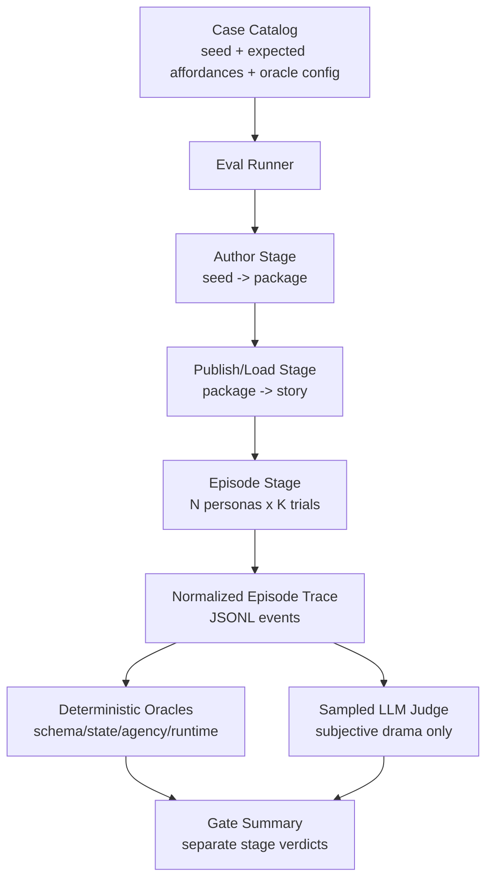

# RPG Eval v3 Redesign

Date: 2026-05-23

## Decision

Restart the project evaluation stack around one question:

> Can a generated interactive drama episode be played by different user
> intents, stay coherent over a long trajectory, and produce visibly different
> consequences without manual explanation?

The old benchmark stack should be removed once v3 is wired:

- `tools/urban_author_play_benchmarks/`
- `tools/play_benchmarks/`
- `tools/author_benchmarks/`
- old gold/self-play/light-ab/LLM-audit tests that exist only to preserve those
  runners
- local historical artifacts under `artifacts/gold_eval/` and
  `artifacts/benchmarks/`

Keep product runtime diagnostics:

- `rpg_backend/benchmark/contracts.py`
- `/benchmark/author/.../diagnostics`
- `/benchmark/play/.../diagnostics`
- author/play trace fields stored by product services

Those are internal observability surfaces, not the eval runner itself.

## What Mature Long-Horizon Evals Do

The useful pattern across mature agent benchmarks is environment-first
evaluation, not judge-first scoring.

- WebArena uses reproducible websites and long-horizon human-like tasks, then
  scores functional task completion rather than only response text quality:
  https://arxiv.org/abs/2307.13854
- OSWorld packages real-computer tasks with initial-state setup and custom
  execution-based evaluation scripts:
  https://arxiv.org/abs/2404.07972
- tau-bench simulates dynamic user-agent conversations, then compares final
  database state to the annotated goal state and uses repeated-trial reliability:
  https://arxiv.org/abs/2406.12045
- ToolSandbox adds stateful tools, implicit dependencies, on-policy user
  simulation, and milestone checks over arbitrary trajectories:
  https://machinelearning.apple.com/research/toolsandbox-stateful-conversational-llm-benchmark
- TextWorld shows why text-game evals need controlled state tracking, reward
  assignment, generated difficulty, and generalization sets:
  https://arxiv.org/abs/1806.11532
- ALFWorld separates abstract planning from concrete execution while keeping
  them aligned:
  https://arxiv.org/abs/2010.03768
- LLM-as-judge methods are useful for subjective quality, but only as a
  calibrated layer. G-Eval and MT-Bench/Chatbot Arena both highlight judge
  bias/limitations:
  https://arxiv.org/abs/2303.16634
  https://arxiv.org/abs/2306.05685

## Eval v3 Goals

The new chain should prove five things separately:

1. **Author validity**: a seed becomes a complete playable package with valid
   schema, cast, segment plan, endings, and required story assets.
2. **Runtime validity**: a player can start a session and complete turns without
   schema failures, repair loops, empty narration, invalid actions, or broken
   state transitions.
3. **Agency**: distinct player policies produce distinct state trajectories,
   route pressure, relationship changes, and likely endings.
4. **Drama quality**: the episode has legible stakes, protagonist identity,
   NPC pressure, escalating consequences, and payoff. This can use a sampled
   judge, but must not hide deterministic failures.
5. **Operational reliability**: cost, latency, provider fallbacks, retries,
   timeouts, and artifact completeness are measured as first-class outputs.

## Non-Goals

- Do not build a model leaderboard.
- Do not use a single aggregate score as the release gate.
- Do not let LLM judges decide whether a broken run is valid.
- Do not mix author generation, runtime execution, simulated-player policy,
  LLM judge availability, and artifact-writing failures into one `passed` flag.
- Do not preserve old gold-set names or v1/v2 metric contracts for compatibility.

## New Architecture



## Core Artifact Contract

Every run writes:

- `run_manifest.json`: git sha, mode, provider config label, case count, persona
  policy count, timestamps, budgets, and feature flags.
- `cases.json`: exact case catalog used.
- `player_policies.json`: exact deterministic player policies used.
- `episode_events.json`: structured JSON array for quick inspection in tests and
  notebooks.
- `episode_trace.jsonl`: append-only event stream. One event per author step,
  publish step, session start, player action, runtime output, state delta,
  ending, failure, and judge call.
- `case_summary.json`: one structured verdict per case.
- `gate_summary.json`: release gate summary. This file is what CI and README
  badges should read.

## Gate Model

Use independent gates:

| Gate | Required evidence | Typical blocker |
| --- | --- | --- |
| `author_valid` | package validates; required assets exist; no fallback-only story | schema/content holes |
| `runtime_valid` | all required turns produce valid trace events | runtime exception, invalid action |
| `agency_valid` | at least two policies diverge in state and route | railroaded choices |
| `trajectory_valid` | state progresses toward stakes and ending | dead turns, no payoff |
| `quality_review_valid` | sampled subjective judge clears threshold | flat drama, weak NPCs |
| `ops_valid` | latency/cost/retry budgets within limits | timeout, provider instability |

The product gate is not `average_score >= X`; it is:

```text
author_valid AND runtime_valid AND agency_valid AND trajectory_valid AND ops_valid
```

`quality_review_valid` should start as advisory until judge calibration has
human examples.

## Failure Taxonomy

Every failure must be exactly one primary category:

- `environment`
- `provider`
- `schema`
- `author_content`
- `runtime_invariant`
- `player_policy`
- `trajectory_oracle`
- `judge_unavailable`
- `judge_disagreement`
- `timeout`
- `artifact`

This prevents the previous problem where a Pydantic logging mismatch looked like
a persona/play quality failure.

## Player Policies

Replace the old persona pack with explicit player policies:

- `power_optimizer`: chooses moves that maximize control/status.
- `truth_revealer`: pushes secrets into public view.
- `relationship_loyalist`: protects one NPC relationship.
- `chaos_escalator`: selects high-risk public moves.
- `cautious_survivor`: avoids irreversible exposure until forced.

Each policy emits:

- selected suggested-action id, when available
- optional freeform input
- reason
- expected pressure direction

The runner records policy decisions, but deterministic oracles judge the
resulting state transitions.

## Case Catalog Shape

Each case should be small and explicit:

```yaml
case_id: wealth_public_heir_short
seed: "..."
expected_shells: ["wealth_families"]
play_length: "short"
required_affordances:
  - public_reveal
  - relationship_tradeoff
  - irreversible_cost
oracle:
  min_turns: 6
  min_distinct_endings: 2
  min_state_divergence: 0.35
  required_state_keys:
    - public_pressure
    - protagonist_control
    - relationship_stance
```

## Deletion/Migration Plan

1. Land `tools/rpg_eval/` with the new contracts, catalog, deterministic
   oracles, and a dry-run runner.
2. Move any still-useful seed-generation helpers into `tools/rpg_eval/`.
3. Update launch-readiness tooling to import the new seed helper instead of
   `tools.play_benchmarks`.
4. Delete old benchmark packages and their tests:
   - `tools/urban_author_play_benchmarks/`
   - `tools/play_benchmarks/`
   - `tools/author_benchmarks/`
   - tests that import those packages directly
5. Add new focused tests:
   - contract serialization
   - failure taxonomy
   - deterministic agency/trajectory oracle behavior
   - dry-run artifact completeness
6. Remove historical benchmark artifacts from the repo workspace.
7. Keep `/benchmark/*` backend diagnostics and `tools/http_product_smoke.py`
   because they verify product health, not legacy eval scoring.

## Unified Suite Entry Point

The canonical new suite is the runtime mode:

```bash
python3 -m tools.rpg_eval.runner --runtime --output-dir artifacts/eval_v3/runtime
```

For local regression, use a bounded deterministic slice:

```bash
python3 -m tools.rpg_eval.runner \
  --runtime \
  --case-limit 1 \
  --policy-limit 3 \
  --max-turns 6 \
  --output-dir artifacts/eval_v3/runtime_check
```

This path intentionally replaces the old author-heavy benchmark shape. Author
quality is still checked, but only as `author_valid` inside a full-chain run:

```text
seed -> author_v3 plan -> publish/load -> play_v2 multi-policy episodes -> gates
```

Legacy author/play/gold tests should not be extended for new quality work. If a
low-level regression needs coverage, add a focused unit test near the runtime
module; if the question is product readiness, add it as a v3 gate or event.

## First v3 Milestone

The first useful milestone is intentionally narrow:

```bash
python3 -m tools.rpg_eval.runner --dry-run --output-dir artifacts/eval_v3/dry_run
```

It must write `run_manifest.json`, `cases.json`, `case_summary.json`, and
`gate_summary.json` without calling an LLM. After that works, wire the real
author/play runtime behind the same artifact contract.
