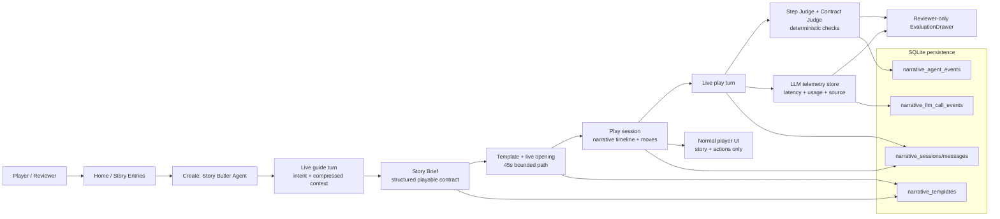

# Tiny Stories Engineering Evidence Packet

This packet frames Tiny Stories as a productized LLM and applied AI systems
project for applications, portfolio pages, and recommender prep. It should not
be used to claim HCI research, SOTA story generation, or broad consumer
robustness. The strongest evidence is the engineered loop: typed contracts,
live LLM calls, persisted telemetry, deterministic judges, reviewer-only
observability, and repeatable validation gates.

Framing: Productized LLM / applied AI systems engineering, not HCI research.

Current live evidence anchor:

On 2026-07-16, the strict live golden-path harness completed a fresh isolated
Create -> Story Brief -> Opening -> 12-turn Play -> Ending run against the
configured gateway. Required calls were `live/success`, no required call used
fallback, and the persisted retry count was zero for every successful call.

- Branch under review: `codex/tiny-stories-target-mode`
- Template/session: `tmpl_8ebe8ce16f83` / `sess_1508a69fc15e`
- Result: 12/12 turns and a generated ending; failure count 0
- Reviewer evidence: 12 Step Judge passes and 12 Contract Judge passes
- Deterministic quality packaging: `warn`, not `fail`. Consequence clarity,
  choice diversity, escalation, brief payoff, and playable options passed. The
  warning is a measurement gap: persisted trace data did not classify an
  active-NPC turn even though NPC interactions appeared in the generated story.
- Player-surface check: Victory ending rendered with no horizontal overflow and
  zero browser console warnings/errors. A bounded copy scan found no technical
  provider/debug/schema/token language; substring matches inside ordinary words
  such as `escaped` and `traceable` were discarded as false positives.

Historical live evidence anchor:

This is a dated 2026-06-08 live-gate snapshot kept for admissions and
recommender evidence. It is not a claim that the commit below is current HEAD;
for the current reviewer run, first check public visibility. If the public-link check
passes, start from the root README, `#/portfolio`, `#/reviewer`, and
`docs/CURRENT_SYSTEM_MAP.md`. If it fails, those routes remain local
verification targets and demo-video context, not public proof.

- Commit: `4382874 fix: keep opening live for eval gate`
- Historical artifact names: live acceptance summary, reviewer screenshot, and
  normal-player screenshot from the 2026-06-08 live gate. These were local
  run outputs, not public links shipped in this repository.
- Current source/local-reviewable evidence: root README,
  `docs/CURRENT_SYSTEM_MAP.md`, `docs/CASE_STUDY.md`, `#/portfolio`,
  `#/reviewer`, and the contract tests listed below. Treat these as public
  evidence only after the public-link check passes.

Current reviewer run boundary:

- Public application wording should cite only source, video, and deployed pages
  that a reviewer can actually open.
- `#/portfolio`, `#/reviewer`, Story Desk, Create, Play, Replay, and local QA
  routes are local verification evidence until the intended branch is pushed,
  deployed, and rechecked.
- If the public-link check fails, describe those surfaces as local evidence or demo
  orientation; do not present them as externally reviewable proof.

Public visibility check:

Before sending this packet as admissions or recruiting evidence, run
`python3 tools/portfolio_public_evidence_preflight.py`. If it reports that
local `HEAD` is ahead of `origin/main`, or that GitHub Pages is missing
current markers, treat the evidence as local-only until the intended branch is
pushed, deployed, and rechecked.

No secret, model, key, or raw provider configuration is included here.

## System Overview

Core runtime boundaries:

- Frontend product shell: `frontend2/src/pages/create/`,
  `frontend2/src/pages/play/`, and shared API/contracts under
  `frontend2/src/api/`.
- Backend orchestration: `rpg_backend/narrative/service.py`.
- LLM gateway and transport: `rpg_backend/narrative/gateway.py` and
  `rpg_backend/responses_transport.py`.
- Opening and turn generation primitives: `rpg_backend/narrative/engine.py`.
- Story Brief/entity hygiene: `rpg_backend/narrative/brief.py`.
- Judge and reviewer evidence contracts: `rpg_backend/narrative/judges.py`,
  `rpg_backend/narrative/contracts.py`, and
  `frontend2/src/pages/play/components/runtime-inspector.tsx`.
- Live evaluation harness:
  `tools/rpg_eval/tiny_stories_reliability_harness.py`.

## Live Evaluation Gate

The current acceptance gate is live-backed. It is not satisfied by `/health`
alone and does not accept deterministic fallback for required product text
paths.

The 2026-07-16 live run exercised:

1. `/health` configured status for `text_llm`, `create_story_butler`,
   `story_brief`, `opening`, and `play_turns`;
2. Story Butler guide turn;
3. Story Brief shaping;
4. template/opening generation;
5. Play story fetch with reviewer trace enabled;
6. twelve Play turns through the configured live text path;
7. live ending, highlight, and branch generation;
8. reviewer-only telemetry and judge evidence.

Run result:

- Status: pass
- Template/session: `tmpl_8ebe8ce16f83` / `sess_1508a69fc15e`
- Failure count: 0
- Completed turns: 12/12
- Step Judge / Contract Judge: 12 pass / 12 pass
- Story Butler latency: 1463ms
- Story Brief latency: 4942ms
- opening latency: 13317ms
- Play turn latency: 9138-18301ms; median 14025ms
- Required-operation fallback count: 0
- Maximum persisted retry count: 0

Required live telemetry table:

| Stage | Operation | Calls | Source/status | Latency (min/median/max) | Input | Cached input | Output | Total | Retry max | Fallback |
| --- | --- | ---: | --- | --- | ---: | ---: | ---: | ---: | ---: | --- |
| Story Butler | `create.story_butler_turn` | 1 | `live/success` | 1463/1463/1463ms | 2389 | 384 | 35 | 2424 | 0 | none |
| Story Brief | `narrative.story_brief` | 1 | `live/success` | 4942/4942/4942ms | 1477 | 0 | 200 | 1677 | 0 | none |
| Opening | `narrative.opening` | 1 | `live/success` | 13317/13317/13317ms | 2716 | 0 | 686 | 3402 | 0 | none |
| Play turns | `narrative.advance_turn` | 12 | `live/success` | 9138/14025/18301ms | 99845 | 64512 | 9128 | 108973 | 0 | none |
| Ending | `narrative.ending` | 1 | `live/success` | 8805/8805/8805ms | 5456 | 0 | 360 | 5816 | 0 | none |
| Highlights | `narrative.highlights` | 1 | `live/success` | 10549/10549/10549ms | 5803 | 0 | 713 | 6516 | 0 | none |
| Branches | `narrative.branches` | 1 | `live/success` | 8252/8252/8252ms | 7688 | 0 | 460 | 8148 | 0 | none |

These are system-validation observations from one bounded canonical run, not
population-level latency, quality, retention, or market evidence. In particular,
the 14.0s median Play-turn latency is a real product risk even though the run
completed without fallback.

The gate rejects these rows for the required operations:

- `fallback_used`
- `no_gateway_fallback`
- non-live source labels
- any non-empty fallback reason
- missing telemetry

Fixture/protocol checks are still useful, but they are not the main acceptance
evidence for a delivered preview.

## Evaluation Architecture

Tiny Stories uses layered product reliability checks rather than a single
untrusted model output.

Step Judge:

- Stored in `narrative_agent_events` as `step_judge`.
- Runs after a submitted Play turn.
- Checks whether the resulting beat preserves player agency, follows the
  submitted move, produces visible consequence, respects the active scene, and
  keeps playable next actions available.

Contract Judge:

- Stored in `narrative_agent_events` as `contract_judge`.
- Checks runtime shape and safety: narrator role, option count, known NPC ids,
  hidden-info leakage, leverage ownership, inventory sanity, and contract
  drift.

Trajectory packaging:

- The reviewer drawer packages persisted per-turn Step/Contract results into a
  deterministic trajectory trend: pass/warn/fail per turn, counts, and compact
  rationale.
- This is not a full live trajectory judge and should not be described as one.
- The richer mock-user chain under `tools/rpg_eval/` remains separate from the
  product drawer.

Reviewer-only observability:

- Reviewer view exposes `Evaluation evidence`, criterion rows, trajectory
  trend, and sanitized telemetry.
- Normal Play view exposes the story, current player move, consequences,
  choices, and scene support only.
- Normal players do not see provider/model/API/schema/token/debug/trace/raw
  judge internals.

## Gold Set And Failure Taxonomy

Gold set file:
`tools/rpg_eval/gold_sets/tiny_stories_reliability.json`.

Scenario categories:

- arbitrary Story Butler input and smalltalk;
- meta/help input;
- unsafe prompt redirect;
- laundromat not-fit gate;
- supported high-drama awards prompt;
- multi-turn correction with superseded facts;
- Play turn consequence.

Failure taxonomy:

- `environment`
- `provider`
- `schema`
- `unsafe_redirect`
- `not_fit_gate`
- `story_guide_intent`
- `brief_contract`
- `entity_hygiene`
- `opening_recovery`
- `step_judge`
- `trajectory_judge`
- `telemetry_missing`
- `normal_ui_leak`
- `artifact`

The taxonomy is product-facing. It is meant to classify actionable release
failures, not to assert a universal benchmark.

## Trace Case Study

Case: `Rigged Trophy Gala`, live-created in the 2026-06-08 passing live gate.

1. Brief
   - Input premise: awards gala, publicist, singer, sponsor, rigged trophy
     reveal, no gore.
   - Story Brief source: `live_hybrid_v1`, runtime source `live`.
   - Story Brief could generate and preserved the safety boundary as a
     constraint, not as a cast member.

2. Opening
   - `narrative.opening`: `live/success`, 13100ms, 2630 input tokens,
     832 output tokens, no fallback reason.
   - Opening created `Rigged Trophy Gala` with Elena Vance and Arthur Sterling
     as scene actors.
   - The opening reached Play without deterministic fallback.

3. Play turn
   - User move: "Pull Arthur aside and demand he tell you everything he knows."
   - `narrative.advance_turn`: `live/success`, 7701ms, no fallback reason.
   - The next beat visibly followed the move: Arthur disclosed that committee
     payments were tied to his name and pressured the player to fix it.

4. Judge/evidence
   - Step Judge: pass, score 100/100 in reviewer drawer.
   - Contract Judge: pass.
   - Trajectory packaging: one judged turn, trend pass.
   - Reviewer telemetry displayed opening and turn rows with latency and token
     usage.

5. Normal UI cleanliness
   - Normal Play screenshot showed story, move, consequence, action choices,
     scene support, and character portraits.
   - It did not show EvaluationDrawer, Telemetry, tokens, provider/model/API,
     schema/debug text, raw JSON, COT, `agent_plan`, `step_judge`, or
     `contract_judge`.

## Known Limitations

- The trajectory drawer is deterministic packaging of turn-level judge results,
  not a calibrated live trajectory judge.
- Step/Contract scores are product evidence UI, not validated academic metrics.
- Gold scenarios are a focused reliability protocol, not a broad benchmark.
- Live provider latency remains variable. The 2026-06-08 opening passed in
  13.1s, but future provider variance still needs monitoring.
- Reviewer evidence is intentionally gated; normal players do not see detailed
  telemetry.
- Avatar matching uses a deterministic tag-vector semantic scorer and manifest,
  not neural embeddings or a vector database.
- The system is a portfolio-grade applied AI runtime, not proof of general
  story-generation robustness or deployed consumer adoption.

## Overclaim Guardrails

Safe:

- "Productized LLM story-game runtime with typed contracts, live generation
  gates, persisted telemetry, deterministic judges, and reviewer-only
  observability."
- "Built an acceptance harness that fails required product paths when live LLM
  calls fall back or telemetry is missing."
- "Implemented deterministic Step/Contract checks and trajectory packaging for
  reviewer evidence."
- "Designed a clean player/reviewer split: normal users get story UX, reviewers
  get sanitized reliability evidence."

Avoid:

- "Published research contribution."
- "State-of-the-art narrative generation."
- "Validated universal story benchmark."
- "Full live trajectory judge" for the deterministic trajectory drawer.
- "Neural embeddings" or "vector database" for the current avatar ranking.
- "Consumer-scale adoption" unless external usage data exists.

## Application-Ready Excerpts

Resume bullets:

- Built Tiny Stories, an applied AI story-game runtime that turns rough prompts
  into playable sessions using typed Story Brief contracts, live LLM generation,
  persisted sessions, and reviewer-only observability.
- Implemented a live acceptance harness that verifies Story Butler, Story Brief,
  opening, and Play-turn calls with source labels, latency, token usage, cache
  tokens, and fallback rejection.
- Added deterministic Step/Contract judges and trajectory packaging so each
  Play turn can be reviewed for agency, consequence alignment, entity coherence,
  option quality, and contract drift.

SOP sentence:

> Tiny Stories is the project where I learned to treat LLM product behavior as
> an engineering system: typed contracts, live-gated execution, telemetry,
> failure taxonomy, reviewer evidence, and player-facing UX boundaries all had
> to work together before I could call a demo reliable.

Project page headline:

> Tiny Stories: a live LLM story-game runtime with typed contracts, evaluator
> traces, and reviewer-only observability.

Recommender prep angle:

- Emphasize system-building: backend orchestration, frontend product surfaces,
  typed contracts, SQLite persistence, live LLM transport, telemetry, judges,
  and validation discipline.
- Avoid framing it as HCI research. The stronger story is applied AI systems
  engineering and product reliability under live model uncertainty.
